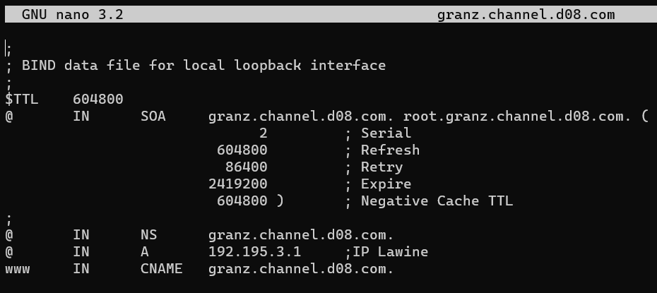
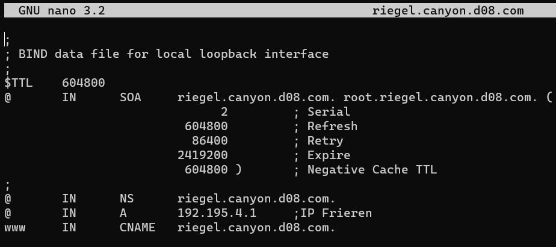
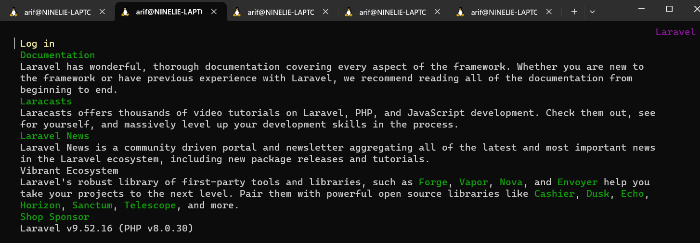

# 🖥️🖥️ Jarkom-Modul-3-D08-2023 🖥️🖥️

Nama Anggota | NRP
------------------- | --------------		
Timothy Hosia Budianto | 5025211098
Arif Nugraha Santosa | 5025211048

## 🟩🟩 LINK 🟩🟩 
Grimore: [Laporan Grimore](https://docs.google.com/document/d/1Yg7rn4ew5XOy3nXlnse9Xtjgm1Y17BX5Jd3T_M-sVFs/edit) <br>
Download Project Link: [Click Here!](https://drive.google.com/file/d/1GWmDh-w7SniZz8YFWjdrWgYOQkSbQnMa/view?usp=sharing)

## 🟩🟩 IP ADDRESS KELOMPOK D08 🟩🟩 
Node Aura (Dynamic)
```
auto eth0
iface eth0 inet dhcp

auto eth1
iface eth1 inet static
	address 192.195.1.195
	netmask 255.255.255.0

auto eth2
iface eth2 inet static
	address 192.195.2.195
	netmask 255.255.255.0

auto eth3
iface eth3 inet static
	address 192.195.3.195
	netmask 255.255.255.0

auto eth4
iface eth4 inet static
	address 192.195.4.195
	netmask 255.255.255.0
```
Node Sein (Dynamic)
```
auto eth0
iface eth0 inet dhcp
```
Node Stark (Dynamic)
```
auto eth0
iface eth0 inet dhcp
```
Node Frieren (Fixed DHCP)
```
auto eth0
iface eth0 inet dhcp
hwaddress ether 62:85:dc:12:6a:e1 //hwaddress eth0
```

Node Flamme (Fixed DHCP)
```
auto eth0
iface eth0 inet dhcp
hwaddress ether 0a:c9:e8:93:9a:99 //hwaddress eth0

```
Node Fern (Fixed DHCP)
```
auto eth0
iface eth0 inet dhcp
hwaddress ether 56:68:5d:5c:05:38 //hwaddress eth0
```
Node Himmel (Static)
```
# Static config for eth0
auto eth0
iface eth0 inet static	
address 192.195.1.1
netmask 255.255.255.0
gateway 192.195.1.195
```
Node Heiter (Static)
```
# Static config for eth0
auto eth0
iface eth0 inet static	
address 192.195.1.2
netmask 255.255.255.0
gateway 192.195.1.195
```
Node Denken (Fixed DHCP)
```
auto eth0
iface eth0 inet dhcp
hwaddress ether d2:5b:49:77:c6:53
```
Node Eisen (Fixed DHCP)
```
auto eth0
iface eth0 inet dhcp
hwaddress ether 2e:14:fa:49:d4:26
```
Node Revolte (Dynamic)
```
auto eth0
iface eth0 inet dhcp
```
Node Richter (Dynamic)
```
auto eth0
iface eth0 inet dhcp
```
Node Lawine (Fixed DHCP)
```
auto eth0
iface eth0 inet dhcp
hwaddress ether 26:5f:26:7d:8f:93
```
Node Linie (Fixed DHCP)
```
auto eth0
iface eth0 inet dhcp
hwaddress ether a2:22:e8:fa:6f:3d
```
Node Lugner (Fixed DHCP)
```
auto eth0
iface eth0 inet dhcp
hwaddress ether 26:88:d2:3f:d6:34
```

## 🟩🟩 PENYELESAIAN 🟩🟩

### ⭕ Nomor 1
Setelah mengalahkan Demon King, perjalanan berlanjut. Kali ini, kalian diminta untuk melakukan register domain berupa riegel.canyon.yyy.com untuk worker Laravel dan granz.channel.yyy.com untuk worker PHP mengarah pada worker yang memiliki IP [prefix IP].x.1.
### 🟢 Jawaban Nomor 1
### 1️⃣ Membuat Topologi
- Susunlah topologi seperti pada gambar di bawah.

- Set agar router dapat terhubung dengan command berikut 
`iptables -t nat -A POSTROUTING -o eth0 -j MASQUERADE -s 192.195.0.0/16 ` dan simpan script di `root/.bashrc`.
- masukan IP gateway router agar client terhubung dengan internet dengan perintah `echo nameserver 192.168.122.1 > /etc/resolv.conf` pada node Himmel (DHCP Server) dan Heiter (DNS server).
- __NOTE: Sedangkan nameserver pada node lain akan diarahkan ke DNS server yaitu Heiter melalui DHCP leasenya.__

### ⭕ Nomor 2 - 5
2. Client yang melalui Switch3 mendapatkan range IP dari [prefix IP].3.16 - [prefix IP].3.32 dan [prefix IP].3.64 - [prefix IP].3.80 (2)
3. Client yang melalui Switch4 mendapatkan range IP dari [prefix IP].4.12 - [prefix IP].4.20 dan [prefix IP].4.160 - [prefix IP].4.168 (3)
4. Client mendapatkan DNS dari Heiter dan dapat terhubung dengan internet melalui DNS tersebut (4)
5. Lama waktu DHCP server meminjamkan alamat IP kepada Client yang melalui Switch3 selama 3 menit sedangkan pada client yang melalui Switch4 selama 12 menit. Dengan waktu maksimal dialokasikan untuk peminjaman alamat IP selama 96 menit (5)

### 🟢 Jawaban Nomor 2 - 5
- Nyalakan node Himmel
- pada Himmel lakukan `apt-get update`
- Dan install DHCP server dengan command berikut `apt-get install isc-dhcp-server -y`
- Pastikan isc-dhcp-server telah ter-install dengan perintah.`dhcpd --version`

#### Konfigurasi DHCP Server
- Pada Himmel buka file Konfigurasi dengan mengedit file `/etc/default/isc-dhcp-server`.
- Dan isi `INTERFACESv4`nya dengan interface yang ingin diberi dhcp.

- Edit file konfigurasi `isc-dhcp-server` pada `nano /etc/dhcp/dhcpd.conf`
- Tambahkan script di bawah.
```sh
# Switch 1
subnet 192.195.1.0 netmask 255.255.255.0 {
}

# Switch 2
subnet 192.195.2.0 netmask 255.255.255.0 {
    option routers 192.195.2.195;
    option broadcast-address 192.195.2.255;
    option domain-name-servers 192.195.1.2;
    default-lease-time 7200;
    max-lease-time 7200;
}

#Client Switch 3
subnet 192.195.3.0 netmask 255.255.255.0 {
    range 192.195.3.16 192.195.3.32;
    range 192.195.3.64 192.195.3.80;
    option routers 192.195.3.195;
    option broadcast-address 192.195.3.255;
    option domain-name-servers 192.195.1.2;
    default-lease-time 180;
    max-lease-time 5760;
}

#Client Switch 4
subnet 192.195.4.0 netmask 255.255.255.0 {
    range 192.195.4.12 192.195.4.20;
    range 192.195.4.160 192.195.4.168;
    option routers 192.195.4.195;
    option broadcast-address 192.195.4.255;
    option domain-name-servers 192.195.1.2;
    default-lease-time 720;
    max-lease-time 5760;
}

#Database Server
host Denken {
    hardware ethernet d2:5b:49:77:c6:53;
    fixed-address 192.195.2.1;
}

#Load Balancer
host Eisen {
    hardware ethernet 2e:14:fa:49:d4:26;
    fixed-address 192.195.2.2;
}

#Laravel Workers
host Frieren {
    hardware ethernet 62:85:dc:12:6a:e1;
    fixed-address 192.195.4.1;
}

host Flamme {
    hardware ethernet 0a:c9:e8:93:9a:99;
    fixed-address 192.195.4.2;
}

host Fern {
    hardware ethernet 56:68:5d:5c:05:38;
    fixed-address 192.195.4.3;
}

#PHP Workers
host Lawine {
    hardware ethernet 26:5f:26:7d:8f:93;
    fixed-address 192.195.3.1;
}

host Linie {
    hardware ethernet a2:22:e8:fa:6f:3d;
    fixed-address 192.195.3.2;
}

host Lugner {
    hardware ethernet 26:88:d2:3f:d6:34;
    fixed-address 192.195.3.3;
}
```
- Restart Service `isc-dhcp-server` Dengan Perintah `service isc-dhcp-server restart`

#### Konfigurasi DHCP Relay
- Pada Aura (Router) masukan perintah berikut.
```sh
apt-get update
apt-get install isc-dhcp-relay -y
service isc-dhcp-relay start
```
- Pada `/etc/default/isc-dhcp-relay` edit INTERFACES dengan interface yang terkoneksi pada client yang ingin diberikan IP konfigurasi berikut.
```sh
SERVERS="[IP Address dari DHCP Server]"  
INTERFACES="eth1 eth3 eth 4" // eth dhcp server, client, client
OPTIONS=
```
- Pada /etc/sysctl.conf uncomment perintah berikut `net.ipv4.ip_forward=1`
- Konfigurasi tersebut digunakan untuk mengaktifkan IP Forwarding. Kemudian, `restart service isc-dhcp-relay`.
- Test dengan cara : buka salah satu client, hasilnya
- 

#### Konfigurasi DNS Server
- Bukalah node Heiter dan masukan command berikut untuk melakukan instalasi.
```sh
apt-get update
apt-get install bind9 -y
```
- Bukalah file berikut dengan command `nano /etc/bind/named.conf.local`.
- Buatlah zone baru.
```sh
zone "riegel.canyon.d08.com" { 
 type 
 master ; 
 file " /etc/bind/jarkom/riegel.canyon.d08.com";
};
 
 zone "granz.channel.d08.com" { 
 type master; 
 file "/etc/bind/jarkom/granz.channel.d08.com";
};
```
- Buat folder untuk menyimpan konfigurasi dengan command berikut `mkdir /etc/bind/jarkom`.
- copy file konfigurasinya dari `/etc/bind/db.local`.
```sh
cp /etc/bind/db.local /etc/bind/jarkom/riegel.canyon.d08.com
cp /etc/bind/db.local /etc/bind/jarkom/granz.channel.d08.com
```
- edit konfigurasi bind dengan command dibawah dan seperti gambar di bawah.
```sh
nano /etc/bind/jarkom/riegel.canyon.d08.com
nano /etc/bind/jarkom/granz.channel.d08.com
```




### ⭕ Nomor 6
Pada masing-masing worker PHP, lakukan konfigurasi virtual host untuk website berikut dengan menggunakan php 7.3.

### 🟢 Jawaban Nomor 6
### 6️⃣ Konfigurasi worker PHP

- Sebelum mengerjakan perlu untuk melakukan setup terlebih dahulu pada seluruh PHP Worker. 
```sh
apt-get update
apt install nginx php php-fpm -y
apt-get install lynx -y
apt-get install htop -y
apt-get install apache2-utils -y

service nginx start
service php7.3-fpm start
```

- Jika sudah, silahkan untuk melakukan konfigurasi tambahan sebagai berikut untuk melakukan download dan unzip menggunakan command wget
```sh
wget -O '/var/www/granz.channel.d08.com' 'https://drive.google.com/u/0/uc?id=1ViSkRq7SmwZgdK64eRbr5Fm1EGCTPrU1&export=download'

unzip -o /var/www/granz.channel.d08.com -d /var/www/
rm /var/www/granz.channel.d08.com
mv /var/www/modul-3 /var/www/granz.channel.d08.com
```
- Setelah melakukan download dan unzip. Sekarang kita bisa melakukan konfigurasi pada nginx. Pertama masuklah pada direktori `etc/nginx/sites-available`. Buatlah file bernama `granz-channel` dan masukan konfigurasi berikut:
```sh
server {

        listen 80;

        root /var/www/granz-channel;

        index index.php index.html index.htm;
        server_name _;

        location / {
                try_files $uri $uri/ /index.php?$query_string;
        }

        # pass PHP scripts to FastCGI server
        location ~ \.php$ {
                include snippets/fastcgi-php.conf;
                fastcgi_pass unix:/var/run/php/php7.3-fpm.sock;
        }

         location ~ /\.ht {
                deny all;
        }

        error_log /var/log/nginx/granz-channel.log;
        access_log /var/log/nginx/granz-channel_access.log;
}
```
- Setelah itu lakukan command berikut:
```sh
ln -s /etc/nginx/sites-available/granz-channel /etc/nginx/sites-enabled
```
- Restart nginx dengan perintah `service nginx restart`.

### 6️⃣ Testing Nomor 6

Pada client lakukan testing dengan menggunakan lynx `lynx 192.195.3.1`


### ⭕ Nomor 7
Kepala suku dari Bredt Region memberikan resource server sebagai berikut:
- Lawine, 4GB, 2vCPU, dan 80 GB SSD.
- Linie, 2GB, 2vCPU, dan 50 GB SSD.
- Lugner 1GB, 1vCPU, dan 25 GB SSD.

aturlah agar Eisen dapat bekerja dengan maksimal, lalu lakukan testing dengan 1000 request dan 100 request/second.

### 🟢 Jawaban Nomor 7
### 7️⃣ Setup Load Balancer pada Eisen

- Instalasi nginx pada load balancer (Eisen) dengan command dibawah:
```sh
apt-get update
apt install nginx php php-fpm -y
apt-get install apache2-utils -y
apt-get install lynx -y

service nginx start
service php7.3-fpm start
```

- Lakukan perintah berikut dan lakukan akukan konfigurasi pada nginx sebagai berikut:
```sh
cp /etc/nginx/sites-available/default /etc/nginx/sites-available/lb-worker
```

- Masukan script berikut ke dalam file lb-worker. `nano /etc/nginx/sites-available/lb-worker`
```sh
upstream worker {
    server 192.195.3.1;
    server 192.195.3.2;
    server 192.195.3.3;
}

server {
    listen 80;
    server_name _;

    location / {
        proxy_pass http://worker;
    }
}
```

- Masukan command berikut untuk membuat binding pada direktori sites-enabled `ln -s /etc/nginx/sites-available/lb-worker /etc/nginx/sites-enabled/`.

- Jangan lupa menghapus page defaultnya dengan melakukan command `rm /etc/nginx/sites-enabled/default`

- Dan restart nginxnya dengan perintah berikut `service nginx restart`.

### 7️⃣ Testing Nomor 7

- Setelah itu lakukan testing pada salah satu client. Disini kami melakukan client Sein.
```sh
ab -n 1000 -c 100 192.195.2.2/ 
```

Hasil:


### ⭕ Nomor 8
Karena diminta untuk menuliskan grimoire, buatlah analisis hasil testing dengan 200 request dan 10 request/second masing-masing algoritma Load Balancer dengan ketentuan sebagai berikut:
- A. Nama Algoritma Load Balancer
- B. Report hasil testing pada Apache Benchmark
- C. Grafik request per second untuk masing masing algoritma. 
- D. Analisis
### 🟢 Jawaban Nomor 8
### 8️⃣ Konfigurasi load balancer pada Eisen
- Sebelum mengerjakan perlu untuk melakukan setup terlebih dahulu. Selebihnya untuk konfigurasinya sama dengan Soal 7.
- Untuk laporan grimoire nya kami membuatnya di link berikut [Laporan Grimore](https://docs.google.com/document/d/1Yg7rn4ew5XOy3nXlnse9Xtjgm1Y17BX5Jd3T_M-sVFs/edit).

- Untuk mengubah algoritmanya, kita akan memodifikasi konfigurasi lb-worker pada `/etc/nginx/sites-available` di node Eisen
- Algoritma round robin

```sh
upstream worker {
    server 192.195.3.1;
    server 192.195.3.2;
    server 192.195.3.3;
}
```


- Algoritma least-connection
```sh
upstream worker {
    least_conn;
    server 192.195.3.1;
    server 192.195.3.2;
    server 192.195.3.3;
}
```


- Algoritma IP Hash
```sh
upstream worker {
    ip_hash;
    server 192.195.3.1;
    server 192.195.3.2;
    server 192.195.3.3;
}
```


- Algoritma Generic Hash
```sh
upstream worker {
    hash $request_uri consistent;
    server 192.195.3.1;
    server 192.195.3.2;
    server 192.195.3.3;
}
```


### ⭕ Nomor 9
Dengan menggunakan algoritma Round Robin, lakukan testing dengan menggunakan 3 worker, 2 worker, dan 1 worker sebanyak 100 request dengan 10 request/second, kemudian tambahkan grafiknya pada grimoire.
### 🟢 Jawaban Nomor 9
### 9️⃣ Setup load balancer pada Eisen
- Untuk mengubah algoritmanya, kita akan memodifikasi konfigurasi lb-worker pada `/etc/nginx/sites-available`
- dan mengurangi worker yang bisa di assign dengan mengurangi upstream worker pada Algoritma round robin.
```sh
upstream worker {
    server 192.195.3.1;
    server 192.195.3.2;
    server 192.195.3.3;
}
```
- 3 worker
- 
- 2 worker
- 
- 1 worker
- 
- Grafik
- 
- 

### ⭕ Nomor 10
Selanjutnya coba tambahkan konfigurasi autentikasi di LB dengan dengan kombinasi username: “netics” dan password: “ajkyyy”, dengan yyy merupakan kode kelompok. Terakhir simpan file “htpasswd” nya di /etc/nginx/rahasisakita/ (10)
### 🟢 Jawaban Nomor 10
### 🔟 Menambahkan konfigurasi htacess
- Sebelum mengerjakan perlu untuk melakukan setup terlebih dahulu. Setelah itu, lakukan beberapa konfigurasi sebagai berikut pada node eisen (load balancer)
```sh
mkdir /etc/nginx/rahasisakita

htpasswd -c /etc/nginx/rahasisakita/htpasswd netics
```
- lalu masukan passwordnya `ajkd08`
- Jika sudah memasukkan password dan re-type password. Sekarang bisa dicoba dengan menambahkan command berikut pada setup nginx. (konfigurasi di file lb-worker)
```sh
auth_basic "Restricted Content";
auth_basic_user_file /etc/nginx/rahasisakita/htpasswd;
```

### 🔟 Testing Nomor 10

- Jadi, ketika kita mengakses kembali ke LB akan terdapat unauthorized sebagai berikut:


### ⭕ Nomor 11
Lalu buat untuk setiap request yang mengandung /its akan di proxy passing menuju halaman https://www.its.ac.id. hint: (proxy_pass)
### 🟢 Jawaban Nomor 11
### 1️⃣1️⃣ Setup proxy pass pada Eisen.

- Sebelum mengerjakan perlu untuk melakukan setup terlebih dahulu. Setelah itu, lakukan beberapa konfigurasi tambahan pada nginx sebagai berikut (konfigurasi di file lb-worker)
```sh
    location ~ /its {
        proxy_pass https://www.its.ac.id;
        proxy_set_header Host www.its.ac.id;
        proxy_set_header X-Real-IP $remote_addr;
        proxy_set_header X-Forwarded-For $proxy_add_x_forwarded_for;
        proxy_set_header X-Forwarded-Proto $scheme;
    }
```
- Maksudnya adalah ketika kita melakukan akses pada endpoint yang mengandung /its akan diarahkan oleh proxy_pass menuju https://www.its.ac.id. Jadi ketika melakukan testing pada client dengan perintah
```sh
lynx 192.195.2.2/its
```


### ⭕ Nomor 12
Selanjutnya LB ini hanya boleh diakses oleh client dengan IP [Prefix IP].3.69, [Prefix IP].3.70, [Prefix IP].4.167, dan [Prefix IP].4.168. (12)
### 🟢 Jawaban Nomor 12
### 1️⃣2️⃣ Konfigurasi nginx pada Eisen.
- konfigurasi nginx (konfigurasi di file lb-worker) dan tambahkan
```sh
location / {
    allow 192.173.3.69;
    allow 192.173.3.70;
    allow 192.173.4.167;
    allow 192.173.4.168;
    deny all;
    proxy_pass http://worker;
}
```
- Berikut script lengkap setelah dikonfigurasi.
```sh
upstream worker {
    server 192.195.3.1;
    server 192.195.3.2;
    server 192.195.3.3;
}

server {
    listen 80;
    server_name _;

    location / {
        proxy_pass http://worker;
        auth_basic "Restricted Content";
        auth_basic_user_file /etc/nginx/rahasisakita/htpasswd;
        allow 192.195.3.69;
        allow 192.195.3.70;
        allow 192.195.4.167;
        allow 192.195.4.168;
        deny all;
    }

    location ~ /its {
        proxy_pass https://www.its.ac.id;
        proxy_set_header Host www.its.ac.id;
        proxy_set_header X-Real-IP $remote_addr;
        proxy_set_header X-Forwarded-For $proxy_add_x_forwarded_for;
        proxy_set_header X-Forwarded-Proto $scheme;
    }
}
```
### 1️⃣2️⃣ Testing Nomor 12

- Hasilnya jika kita mencoba akses lewat ip yang belum di assign sebelumnya akan menghasilkan.


### ⭕ Nomor 13
Semua data yang diperlukan, diatur pada Denken dan harus dapat diakses oleh Frieren, Flamme, dan Fern.
### 🟢 Jawaban Nomor 13
### 1️⃣3️⃣ Setup database server (Denken)
- Sebelum mengerjakan perlu untuk melakukan setup terlebih dahulu. Setelah itu kita buka Database Server nya yaitu Denken dan lakukan konfigurasi sebagai berikut
```sh
echo '# This group is read both by the client and the server
# use it for options that affect everything
[client-server]

# Import all .cnf files from configuration directory
!includedir /etc/mysql/conf.d/
!includedir /etc/mysql/mariadb.conf.d/

# Options affecting the MySQL server (mysqld)
[mysqld]
skip-networking=0
skip-bind-address
' > /etc/mysql/my.cnf
```
- Lalu jangan lupa untuk mengganti [bind-address] pada file /etc/mysql/mariadb.conf.d/50-server.cnf menjadi 0.0.0.0
```sh
cd /etc/mysql/mariadb.conf.d/50-server.cnf

# Changes
bind-address            = 0.0.0.0
```
- Jangan lupa `service mysql restart`
- Setelah itu jalankan perintah berikut
```sh
mysql -u root -p
```
Dan masukan perintah berikut.
```sh
CREATE USER 'kelompokd08'@'%' IDENTIFIED BY 'passwordd08';
CREATE USER 'kelompokd08'@'localhost' IDENTIFIED BY 'passwordd08';
CREATE DATABASE dbkelompokd08;
GRANT ALL PRIVILEGES ON *.* TO 'kelompokd08'@'%';
GRANT ALL PRIVILEGES ON *.* TO 'kelompokd08'@'localhost';
FLUSH PRIVILEGES;
```

### 1️⃣3️⃣ Testing Nomor 13

- Hasilnya jika kita melakukan command shell pada salah satu worker laravel.
```sh
mariadb --host=192.195.2.1 --port=3306 --user=kelompokd08 --password=passwordd08 dbkelompokd08 -e "SHOW DATABASES;"
```


### ⭕ Nomor 14
Frieren, Flamme, dan Fern memiliki Granz Channel sesuai dengan quest guide berikut. Jangan lupa melakukan instalasi PHP8.0 dan Composer
### 🟢 Jawaban Nomor 14
### 1️⃣4️⃣ Setup laravel pada masing masing worker Laravel

- Untuk setup cukup simple, cukup jalankan script berikut pada setiap worker laravel.

```sh
apt-get -o Acquire::Check-Valid-Until=false -o Acquire::Check-Date=false update
apt-get install lynx -y
apt-get install mariadb-client -y

apt-get install -y lsb-release ca-certificates apt-transport-https software-properties-common gnupg2
curl -sSLo /usr/share/keyrings/deb.sury.org-php.gpg https://packages.sury.org/php/apt.gpg
sh -c 'echo "deb [signed-by=/usr/share/keyrings/deb.sury.org-php.gpg] https://packages.sury.org/php/ $(lsb_release -sc) main" > /etc/apt/sources.list.d/php.list'
apt-get update
apt-get install php8.0-mbstring php8.0-xml php8.0-cli php8.0-common php8.0-intl php8.0-opcache php8.0-readline php8.0-mysql php8.0-fpm php8.0-curl unzip wget -y
apt-get install nginx -y

service nginx start
service php8.0-fpm start

wget https://getcomposer.org/download/2.0.13/composer.phar
chmod +x composer.phar
mv composer.phar /usr/bin/composer

apt-get install git -y
cd /var/www && git clone https://github.com/martuafernando/laravel-praktikum-jarkom
cd /var/www/laravel-praktikum-jarkom && composer update

cd /var/www/laravel-praktikum-jarkom && cp .env.example .env

echo 'APP_NAME=Laravel
APP_ENV=local
APP_KEY=
APP_DEBUG=true
APP_URL=http://localhost

LOG_CHANNEL=stack
LOG_DEPRECATIONS_CHANNEL=null
LOG_LEVEL=debug

DB_CONNECTION=mysql
DB_HOST=192.195.2.1
DB_PORT=3306
DB_DATABASE=dbkelompokd08
DB_USERNAME=kelompokd08
DB_PASSWORD=passwordd08

BROADCAST_DRIVER=log
CACHE_DRIVER=file
FILESYSTEM_DISK=local
QUEUE_CONNECTION=sync
SESSION_DRIVER=file
SESSION_LIFETIME=120

MEMCACHED_HOST=127.0.0.1

REDIS_HOST=127.0.0.1
REDIS_PASSWORD=null
REDIS_PORT=6379

MAIL_MAILER=smtp
MAIL_HOST=mailpit
MAIL_PORT=1025
MAIL_USERNAME=null
MAIL_PASSWORD=null
MAIL_ENCRYPTION=null
MAIL_FROM_ADDRESS="hello@example.com"
MAIL_FROM_NAME="${APP_NAME}"

AWS_ACCESS_KEY_ID=
AWS_SECRET_ACCESS_KEY=
AWS_DEFAULT_REGION=us-east-1
AWS_BUCKET=
AWS_USE_PATH_STYLE_ENDPOINT=false

PUSHER_APP_ID=
PUSHER_APP_KEY=
PUSHER_APP_SECRET=
PUSHER_HOST=
PUSHER_PORT=443
PUSHER_SCHEME=https
PUSHER_APP_CLUSTER=mt1

VITE_PUSHER_APP_KEY="${PUSHER_APP_KEY}"
VITE_PUSHER_HOST="${PUSHER_HOST}"
VITE_PUSHER_PORT="${PUSHER_PORT}"
VITE_PUSHER_SCHEME="${PUSHER_SCHEME}"
VITE_PUSHER_APP_CLUSTER="${PUSHER_APP_CLUSTER}"' > /var/www/laravel-praktikum-jarkom/.env

cd /var/www/laravel-praktikum-jarkom && php artisan key:generate
cd /var/www/laravel-praktikum-jarkom && php artisan config:cache
cd /var/www/laravel-praktikum-jarkom && php artisan migrate
cd /var/www/laravel-praktikum-jarkom && php artisan db:seed
cd /var/www/laravel-praktikum-jarkom && php artisan storage:link
cd /var/www/laravel-praktikum-jarkom && php artisan jwt:secret
cd /var/www/laravel-praktikum-jarkom && php artisan config:clear

chown -R www-data.www-data /var/www/laravel-praktikum-jarkom/storage

echo 'server {
    listen 8001;

    root /var/www/laravel-praktikum-jarkom/public;

    index index.php index.html index.htm;
    server_name _;

    location / {
            try_files $uri $uri/ /index.php?$query_string;
    }

    # pass PHP scripts to FastCGI server
    location ~ \.php$ {
      include snippets/fastcgi-php.conf;
      fastcgi_pass unix:/var/run/php/php8.0-fpm.sock;
    }

    location ~ /\.ht {
            deny all;
    }

    error_log /var/log/nginx/implementasi_error.log;
    access_log /var/log/nginx/implementasi_access.log;
}' > /etc/nginx/sites-available/laravel-worker

ln -s /etc/nginx/sites-available/laravel-worker /etc/nginx/sites-enabled
rm /etc/nginx/sites-enabled/default

service nginx restart
```

- Perhatikan port pada file `/etc/nginx/sites-available/laravel-worker` kami assign sebagai berikut:
```sh
Frieren: 8001
Flamme: 8002
Fern: 8003
```

### 1️⃣4️⃣ Testing Nomor 14

- Dengan menggunakan `lynx localhost:8001` berikut tampilan web Laravel pada Frieren.



### ⭕ Nomor 15
Granz Channel memiliki beberapa endpoint yang harus ditesting sebanyak 100 request dengan 10 request/second. Tambahkan response dan hasil testing pada grimoire.

POST /auth/register
### 🟢 Jawaban Nomor 15

### 1️⃣5️⃣ Testing
- Untuk mengerjakan soal ini. Diperlukan melakukan testing menggunakan Apache Benchmark pada salah satu worker saja. Disini kami akan menggunakan worker laravel Frieren yang nantinya akan menjadi worker yang akan ditesting oleh client Sein. 

- Sebelum dilakukan testing, kami menggunakan bantuan file .json yang akan digunakan sebagai body yang akan dikirim pada endpoint /api/auth/register nantinya sebagai berikut. File .json dibuat pada client.

```sh
echo '
{
  "username": "kelompokD08",
  "password": "passwordD08"
}' > /root/register.json
```
### 1️⃣5️⃣ Testing Nomor 15


- Lalu pada client Sein, masukan perintah berikut:
```sh
ab -n 100 -c 10 -p /root/register.json -T application/json http://192.195.4.1:8001/api/auth/register/
```

Terdapat error dalam pengiriman sebanyak 100 request. Dikarenakan pada table users adalah unique. Dimana data username yang dimasukkan tidak boleh sama. Sehingga menyebabkan hanya 1 request saja yang diproses. 99 proses lainnya tidak diproses

Hasilnya dapat dilihat pada link grimore berikut poin nomor 15: 
[Laporan Grimore](https://docs.google.com/document/d/1Yg7rn4ew5XOy3nXlnse9Xtjgm1Y17BX5Jd3T_M-sVFs/edit).


### ⭕ Nomor 16
POST /auth/login
### 🟢 Jawaban Nomor 16
### 1️⃣6️⃣ Testing
- Langkahnya sama dengan nomor 15, namun menggunakan URL yang berbeda.

```sh
echo '
{
  "username": "kelompokD08",
  "password": "passwordD08"
}' > /root/login.json
```

### 1️⃣6️⃣ Testing Nomor 16

- Lalu pada client Sein, masukan perintah berikut:
```sh
ab -n 100 -c 10 -p /root/login.json -T application/json http://192.195.4.1:8001/api/auth/login/
```

Terdapat error dalam pengiriman sebanyak 100 request. Karena satu worker saja tidak kuat untuk mendapatkan request sebanyak itu 100 dalam waktu yang telah diberikan atau dengan kata lain CPU yang diterima tidak sanggup untuk memproses banyaknya request. Sehingga menyebabkan hanya beberapa request saja yang berhasil di proses sedangkan lainnya tidak berhasil di proses.

Hasilnya dapat dilihat pada link grimore berikut poin nomor 16: 
[Laporan Grimore](https://docs.google.com/document/d/1Yg7rn4ew5XOy3nXlnse9Xtjgm1Y17BX5Jd3T_M-sVFs/edit).


### ⭕ Nomor 17
GET /me
### 🟢 Jawaban Nomor 17
### 1️⃣7️⃣ Testing

- Siapkan token terlebih dahulu sebelum mengakses `/api/me`
```
curl -X POST -H "Content-Type: application/json" -d @/root/login.json http://192.195.4.1:8001/api/auth/login > login_output.txt
```


- Lalu jalankan perintah berikut untuk melakukan set token secara global
```
token=$(cat login_output.txt | jq -r '.token')
```

### 1️⃣7️⃣ Testing Nomor 17

- Jalankan perintah berikut untuk melakukan testing
```
ab -n 100 -c 10 -H "Authorization: Bearer $token" http://192.195.4.1:8001/api/me
```

Pada saat melakukan GET /me tetap terjadi Failed sebanyak beberapa request yang diakibatkan karena CPU pada 1 worker tidak kuat untuk menghandle 100 request dengan 10 request per detik sehingga terdapat Failed.

Hasilnya dapat dilihat pada link grimore berikut poin nomor 17: 
[Laporan Grimore](https://docs.google.com/document/d/1Yg7rn4ew5XOy3nXlnse9Xtjgm1Y17BX5Jd3T_M-sVFs/edit).


### ⭕ Nomor 18
Untuk memastikan ketiganya bekerja sama secara adil untuk mengatur Granz Channel maka implementasikan Proxy Bind pada Eisen untuk mengaitkan IP dari Frieren, Flamme, dan Fern.
### 🟢 Jawaban Nomor 18
### 1️⃣8️⃣ Setup Proxy Bind

Implementasikan Load Balancing karena sesuai dengan definisi nya yaitu membagi rata beban kerja. Maka dari itu, berikut merupakan konfigurasi nginx.

- Pada node Load Balancer buatlah sebuah file baru bernama `lb-laravel` pada direktori `/etc/nginx/sites-available`. Berikut adalah isi filenya:
```sh
upstream laravel {
    server 192.195.4.1:8001;
    server 192.195.4.2:8002;
    server 192.195.4.3:8003;
}

server {
    listen 80;
    server_name _;

    location / {
        proxy_pass http://laravel;
    }
}
```

- Jangan lupa untuk mengaitkan file tersebut ke direktori `sites-enabled` dengan command:
```sh
ln -s /etc/nginx/sites-available/lb-laravel /etc/nginx/sites-enabled
```

- Restart nginxnya dengan command `service nginx restart`.

__Hati-hati port tabrakan dengan load balancer dari php worker__

### 1️⃣8️⃣ Testing Nomor 18

Setelah melakukan konfigurasi pada load balancer pada Eisen. Sekarang waktunya melakukan testing pada client Sein dengan menjalankan perintah berikut:
```sh
ab -n 100 -c 10 -p /root/login.json -T application/json http://192.195.2.2/api/auth/login
```

Berikut adalah hasil benchmarknya.


### ⭕ Nomor 19
Untuk meningkatkan performa dari Worker, coba implementasikan PHP-FPM pada Frieren, Flamme, dan Fern. Untuk testing kinerja naikkan 
- pm.max_children
- pm.start_servers
- pm.min_spare_servers
- pm.max_spare_servers
sebanyak tiga percobaan dan lakukan testing sebanyak 100 request dengan 10 request/second kemudian berikan hasil analisisnya pada Grimoire.(19)
### 🟢 Jawaban Nomor 19
### 1️⃣9️⃣ Setup /etc/php/8.0/fpm/pool.d/www.conf

PHP-FPM (FastCGI Process Manager) adalah manajer proses untuk server web yang mendukung PHP. Ini memungkinkan server web seperti Nginx atau Apache untuk menangani permintaan PHP dengan efisien.

1. **pm.max_children:**
   - **Deskripsi:** Menentukan jumlah maksimal proses anak (child processes) yang diizinkan pada suatu waktu.
   - **Pentingnya:** Mengatur batas maksimum ini dapat mencegah server dari penggunaan sumber daya yang berlebihan. Jumlah maksimum anak yang optimal tergantung pada jumlah total sumber daya yang tersedia pada server.

2. **pm.start_servers:**
   - **Deskripsi:** Menentukan jumlah proses anak yang akan dibuat saat PHP-FPM pertama kali dijalankan atau saat di-restart.
   - **Pentingnya:** Jumlah awal server yang sesuai dapat mempercepat respons server ketika menerima permintaan pertama setelah restart.

3. **pm.min_spare_servers:**
   - **Deskripsi:** Menentukan jumlah minimum proses anak yang akan tetap aktif dan menunggu permintaan.
   - **Pentingnya:** Menjaga jumlah minimum server yang aktif dapat mengurangi waktu latensi karena tidak perlu membuat proses anak baru setiap kali ada permintaan.

4. **pm.max_spare_servers:**
   - **Deskripsi:** Menentukan jumlah maksimum proses anak yang dapat tetap aktif dan menunggu permintaan.
   - **Pentingnya:** Mengatur batas maksimum server yang tetap aktif dapat membantu menghindari penggunaan sumber daya yang berlebihan dan memastikan ketersediaan sumber daya untuk tugas lain.

__Setiap memasukan Script, jangan lupa untuk memasukan command `service php8.0-fpm restart` Lakukan ini pada setiap worker laravel!!!__ 

### Script 1
```sh
echo '[www]
user = www-data
group = www-data
listen = /run/php/php8.0-fpm.sock
listen.owner = www-data
listen.group = www-data
php_admin_value[disable_functions] = exec,passthru,shell_exec,system
php_admin_flag[allow_url_fopen] = off

; Choose how the process manager will control the number of child processes.

pm = dynamic
pm.max_children = 5
pm.start_servers = 2
pm.min_spare_servers = 1
pm.max_spare_servers = 3' > /etc/php/8.0/fpm/pool.d/www.conf

```

### Script 2
```sh
echo '[www]
user = www-data
group = www-data
listen = /run/php/php8.0-fpm.sock
listen.owner = www-data
listen.group = www-data
php_admin_value[disable_functions] = exec,passthru,shell_exec,system
php_admin_flag[allow_url_fopen] = off

; Choose how the process manager will control the number of child processes.

pm = dynamic
pm.max_children = 25
pm.start_servers = 5
pm.min_spare_servers = 3
pm.max_spare_servers = 10' > /etc/php/8.0/fpm/pool.d/www.conf
```

### Script 3
```sh
echo '[www]
user = www-data
group = www-data
listen = /run/php/php8.0-fpm.sock
listen.owner = www-data
listen.group = www-data
php_admin_value[disable_functions] = exec,passthru,shell_exec,system
php_admin_flag[allow_url_fopen] = off

; Choose how the process manager will control the number of child processes.

pm = dynamic
pm.max_children = 50
pm.start_servers = 8
pm.min_spare_servers = 5
pm.max_spare_servers = 15' > /etc/php/8.0/fpm/pool.d/www.conf
```

### 1️⃣9️⃣ Testing Nomor 19

- Script 1


- Script 2


- Script 3


### ⭕ Nomor 20
Nampaknya hanya menggunakan PHP-FPM tidak cukup untuk meningkatkan performa dari worker maka implementasikan Least-Conn pada Eisen. Untuk testing kinerja dari worker tersebut dilakukan sebanyak 100 request dengan 10 request/second.
### 🟢 Jawaban Nomor 20
### 2️⃣0️⃣ Setup nginx pada Eisen

- Pada node Eisen, edit file `/etc/nginx/sites-available/lb-laravel` menjadi seperti di bawah:
```sh
upstream laravel {
    least_conn;
    server 192.195.4.1:8001;
    server 192.195.4.2:8002;
    server 192.195.4.3:8003;
}

server {
    listen 80;
    server_name _;

    location / {
        proxy_pass http://laravel;
    }
}
```

- Lalu restart nginx dengan command `service nginx restart`

- Jangan lupa atur package manager sebagai berikut pada masing-masing worker laravel:
```sh
echo '[www]
user = www-data
group = www-data
listen = /run/php/php8.0-fpm.sock
listen.owner = www-data
listen.group = www-data
php_admin_value[disable_functions] = exec,passthru,shell_exec,system
php_admin_flag[allow_url_fopen] = off

; Choose how the process manager will control the number of child processes.

pm = dynamic
pm.max_children = 50
pm.start_servers = 8
pm.min_spare_servers = 5
pm.max_spare_servers = 15' > /etc/php/8.0/fpm/pool.d/www.conf
```

### 2️⃣0️⃣ Testing Nomor 20


Least connection berjalan cukup baik.

## 🟩🟩 .BASHRC SCRIPT 🟩🟩

Setiap konfigurasi akan disimpan dalam folder `/root` yang kemudian akan dicopy lagi dengan menggunakan file `/root/.bashrc`. Berikut adalah isi file `.bashrc` dari setiap node:

### Aura (Router, DHCP Relay)
```sh
iptables -t nat -A POSTROUTING -o eth0 -j MASQUERADE -s 192.195.0.0/16

apt-get update
apt-get install isc-dhcp-relay -y
apt-get install lynx -y
service isc-dhcp-relay start

cp -rf /root/etc/sysctl.conf /etc/
cp -rf /root/etc/default /etc/

service isc-dhcp-relay restart
```

### Himmel (DHCP Server)
```sh
echo nameserver 192.168.122.1 > /etc/resolv.conf

apt-get update
apt-get install isc-dhcp-server -y
service isc-dhcp-server stop
rm /var/run/dhcpd.pid

cp -rf /root/etc/default /etc
cp -rf /root/etc/dhcp /etc

service isc-dhcp-server start
```

### Heiter (DNS Server)
```sh
echo nameserver 192.168.122.1 > /etc/resolv.conf

apt-get update
apt-get install bind9 -y

cp -rf /root/etc/bind /etc/

service bind9 restart
```

### Eisen (Load Balancer)
```sh
apt-get update
apt install nginx php php-fpm -y
apt-get install apache2-utils -y
apt-get install lynx -y
service nginx start
service php7.3-fpm start
cp -r -f /root/etc/nginx /etc
rm -r -f /etc/nginx/sites-enabled/default
ln -s /etc/nginx/sites-available/lb-worker /etc/nginx/sites-enabled
service nginx restart
```

### Denken (Database Server)
```sh
apt-get update
apt-get install mariadb-server -y
service mysql start

#CREATE USER 'kelompokd08'@'%' IDENTIFIED BY 'passwordd08';
#CREATE USER 'kelompokd08'@'localhost' IDENTIFIED BY 'passwordd08';
#CREATE DATABASE dbkelompokd08;
#GRANT ALL PRIVILEGES ON *.* TO 'kelompokd08'@'%';
#GRANT ALL PRIVILEGES ON *.* TO 'kelompokd08'@'localhost';
#FLUSH  PRIVILEGES;

cp -r -f /root/etc/mysql /etc
service mysql restart
```

### Frieren (Laravel Worker)
```sh
apt-get -o Acquire::Check-Valid-Until=false -o Acquire::Check-Date=false update
apt-get install lynx -y
apt-get install mariadb-client -y

apt-get install -y lsb-release ca-certificates apt-transport-https software-properties-common gnupg2
curl -sSLo /usr/share/keyrings/deb.sury.org-php.gpg https://packages.sury.org/php/apt.gpg
sh -c 'echo "deb [signed-by=/usr/share/keyrings/deb.sury.org-php.gpg] https://packages.sury.org/php/ $(lsb_release -sc) main" > /etc/apt/sources.list.d/php.list'
apt-get update
apt-get install php8.0-mbstring php8.0-xml php8.0-cli php8.0-common php8.0-intl php8.0-opcache php8.0-readline php8.0-mysql php8.0-fpm php8.0-curl unzip wget -y
apt-get install nginx -y

service nginx start
service php8.0-fpm start

wget https://getcomposer.org/download/2.0.13/composer.phar
chmod +x composer.phar
mv composer.phar /usr/bin/composer

apt-get install git -y
cd /var/www && git clone https://github.com/martuafernando/laravel-praktikum-jarkom
cd /var/www/laravel-praktikum-jarkom && composer update

cd /var/www/laravel-praktikum-jarkom && cp .env.example .env

echo 'APP_NAME=Laravel
APP_ENV=local
APP_KEY=
APP_DEBUG=true
APP_URL=http://localhost

LOG_CHANNEL=stack
LOG_DEPRECATIONS_CHANNEL=null
LOG_LEVEL=debug

DB_CONNECTION=mysql
DB_HOST=192.195.2.1
DB_PORT=3306
DB_DATABASE=dbkelompokd08
DB_USERNAME=kelompokd08
DB_PASSWORD=passwordd08

BROADCAST_DRIVER=log
CACHE_DRIVER=file
FILESYSTEM_DISK=local
QUEUE_CONNECTION=sync
SESSION_DRIVER=file
SESSION_LIFETIME=120

MEMCACHED_HOST=127.0.0.1

REDIS_HOST=127.0.0.1
REDIS_PASSWORD=null
REDIS_PORT=6379

MAIL_MAILER=smtp
MAIL_HOST=mailpit
MAIL_PORT=1025
MAIL_USERNAME=null
MAIL_PASSWORD=null
MAIL_ENCRYPTION=null
MAIL_FROM_ADDRESS="hello@example.com"
MAIL_FROM_NAME="${APP_NAME}"

AWS_ACCESS_KEY_ID=
AWS_SECRET_ACCESS_KEY=
AWS_DEFAULT_REGION=us-east-1
AWS_BUCKET=
AWS_USE_PATH_STYLE_ENDPOINT=false

PUSHER_APP_ID=
PUSHER_APP_KEY=
PUSHER_APP_SECRET=
PUSHER_HOST=
PUSHER_PORT=443
PUSHER_SCHEME=https
PUSHER_APP_CLUSTER=mt1

VITE_PUSHER_APP_KEY="${PUSHER_APP_KEY}"
VITE_PUSHER_HOST="${PUSHER_HOST}"
VITE_PUSHER_PORT="${PUSHER_PORT}"
VITE_PUSHER_SCHEME="${PUSHER_SCHEME}"
VITE_PUSHER_APP_CLUSTER="${PUSHER_APP_CLUSTER}"' > /var/www/laravel-praktikum-jarkom/.env

cd /var/www/laravel-praktikum-jarkom && php artisan key:generate
cd /var/www/laravel-praktikum-jarkom && php artisan config:cache
cd /var/www/laravel-praktikum-jarkom && php artisan migrate
cd /var/www/laravel-praktikum-jarkom && php artisan db:seed
cd /var/www/laravel-praktikum-jarkom && php artisan storage:link
cd /var/www/laravel-praktikum-jarkom && php artisan jwt:secret
cd /var/www/laravel-praktikum-jarkom && php artisan config:clear

chown -R www-data.www-data /var/www/laravel-praktikum-jarkom/storage

echo 'server {
    listen 8001;

    root /var/www/laravel-praktikum-jarkom/public;

    index index.php index.html index.htm;
    server_name _;

    location / {
            try_files $uri $uri/ /index.php?$query_string;
    }

    # pass PHP scripts to FastCGI server
    location ~ \.php$ {
      include snippets/fastcgi-php.conf;
      fastcgi_pass unix:/var/run/php/php8.0-fpm.sock;
    }

    location ~ /\.ht {
            deny all;
    }

    error_log /var/log/nginx/implementasi_error.log;
    access_log /var/log/nginx/implementasi_access.log;
}' > /etc/nginx/sites-available/laravel-worker

ln -s /etc/nginx/sites-available/laravel-worker /etc/nginx/sites-enabled
rm /etc/nginx/sites-enabled/default

service nginx restart
```

### Flamme (Laravel Worker)
```sh
apt-get -o Acquire::Check-Valid-Until=false -o Acquire::Check-Date=false update
apt-get install lynx -y
apt-get install mariadb-client -y

apt-get install -y lsb-release ca-certificates apt-transport-https software-properties-common gnupg2
curl -sSLo /usr/share/keyrings/deb.sury.org-php.gpg https://packages.sury.org/php/apt.gpg
sh -c 'echo "deb [signed-by=/usr/share/keyrings/deb.sury.org-php.gpg] https://packages.sury.org/php/ $(lsb_release -sc) main" > /etc/apt/sources.list.d/php.list'
apt-get update
apt-get install php8.0-mbstring php8.0-xml php8.0-cli php8.0-common php8.0-intl php8.0-opcache php8.0-readline php8.0-mysql php8.0-fpm php8.0-curl unzip wget -y
apt-get install nginx -y

service nginx start
service php8.0-fpm start

wget https://getcomposer.org/download/2.0.13/composer.phar
chmod +x composer.phar
mv composer.phar /usr/bin/composer

apt-get install git -y
cd /var/www && git clone https://github.com/martuafernando/laravel-praktikum-jarkom
cd /var/www/laravel-praktikum-jarkom && composer update

cd /var/www/laravel-praktikum-jarkom && cp .env.example .env

echo 'APP_NAME=Laravel
APP_ENV=local
APP_KEY=
APP_DEBUG=true
APP_URL=http://localhost

LOG_CHANNEL=stack
LOG_DEPRECATIONS_CHANNEL=null
LOG_LEVEL=debug

DB_CONNECTION=mysql
DB_HOST=192.195.2.1
DB_PORT=3306
DB_DATABASE=dbkelompokd08
DB_USERNAME=kelompokd08
DB_PASSWORD=passwordd08

BROADCAST_DRIVER=log
CACHE_DRIVER=file
FILESYSTEM_DISK=local
QUEUE_CONNECTION=sync
SESSION_DRIVER=file
SESSION_LIFETIME=120

MEMCACHED_HOST=127.0.0.1

REDIS_HOST=127.0.0.1
REDIS_PASSWORD=null
REDIS_PORT=6379

MAIL_MAILER=smtp
MAIL_HOST=mailpit
MAIL_PORT=1025
MAIL_USERNAME=null
MAIL_PASSWORD=null
MAIL_ENCRYPTION=null
MAIL_FROM_ADDRESS="hello@example.com"
MAIL_FROM_NAME="${APP_NAME}"

AWS_ACCESS_KEY_ID=
AWS_SECRET_ACCESS_KEY=
AWS_DEFAULT_REGION=us-east-1
AWS_BUCKET=
AWS_USE_PATH_STYLE_ENDPOINT=false

PUSHER_APP_ID=
PUSHER_APP_KEY=
PUSHER_APP_SECRET=
PUSHER_HOST=
PUSHER_PORT=443
PUSHER_SCHEME=https
PUSHER_APP_CLUSTER=mt1

VITE_PUSHER_APP_KEY="${PUSHER_APP_KEY}"
VITE_PUSHER_HOST="${PUSHER_HOST}"
VITE_PUSHER_PORT="${PUSHER_PORT}"
VITE_PUSHER_SCHEME="${PUSHER_SCHEME}"
VITE_PUSHER_APP_CLUSTER="${PUSHER_APP_CLUSTER}"' > /var/www/laravel-praktikum-jarkom/.env

cd /var/www/laravel-praktikum-jarkom && php artisan key:generate
cd /var/www/laravel-praktikum-jarkom && php artisan config:cache
cd /var/www/laravel-praktikum-jarkom && php artisan migrate
cd /var/www/laravel-praktikum-jarkom && php artisan db:seed
cd /var/www/laravel-praktikum-jarkom && php artisan storage:link
cd /var/www/laravel-praktikum-jarkom && php artisan jwt:secret
cd /var/www/laravel-praktikum-jarkom && php artisan config:clear

chown -R www-data.www-data /var/www/laravel-praktikum-jarkom/storage

echo 'server {
    listen 8002;

    root /var/www/laravel-praktikum-jarkom/public;

    index index.php index.html index.htm;
    server_name _;

    location / {
            try_files $uri $uri/ /index.php?$query_string;
    }

    # pass PHP scripts to FastCGI server
    location ~ \.php$ {
      include snippets/fastcgi-php.conf;
      fastcgi_pass unix:/var/run/php/php8.0-fpm.sock;
    }

    location ~ /\.ht {
            deny all;
    }

    error_log /var/log/nginx/implementasi_error.log;
    access_log /var/log/nginx/implementasi_access.log;
}' > /etc/nginx/sites-available/laravel-worker

ln -s /etc/nginx/sites-available/laravel-worker /etc/nginx/sites-enabled
rm /etc/nginx/sites-enabled/default

service nginx restart
```

### Fern (Laravel Worker)
```sh
apt-get -o Acquire::Check-Valid-Until=false -o Acquire::Check-Date=false update
apt-get install lynx -y
apt-get install mariadb-client -y

apt-get install -y lsb-release ca-certificates apt-transport-https software-properties-common gnupg2
curl -sSLo /usr/share/keyrings/deb.sury.org-php.gpg https://packages.sury.org/php/apt.gpg
sh -c 'echo "deb [signed-by=/usr/share/keyrings/deb.sury.org-php.gpg] https://packages.sury.org/php/ $(lsb_release -sc) main" > /etc/apt/sources.list.d/php.list'
apt-get update
apt-get install php8.0-mbstring php8.0-xml php8.0-cli php8.0-common php8.0-intl php8.0-opcache php8.0-readline php8.0-mysql php8.0-fpm php8.0-curl unzip wget -y
apt-get install nginx -y

service nginx start
service php8.0-fpm start

wget https://getcomposer.org/download/2.0.13/composer.phar
chmod +x composer.phar
mv composer.phar /usr/bin/composer

apt-get install git -y
cd /var/www && git clone https://github.com/martuafernando/laravel-praktikum-jarkom
cd /var/www/laravel-praktikum-jarkom && composer update

cd /var/www/laravel-praktikum-jarkom && cp .env.example .env

echo 'APP_NAME=Laravel
APP_ENV=local
APP_KEY=
APP_DEBUG=true
APP_URL=http://localhost

LOG_CHANNEL=stack
LOG_DEPRECATIONS_CHANNEL=null
LOG_LEVEL=debug

DB_CONNECTION=mysql
DB_HOST=192.195.2.1
DB_PORT=3306
DB_DATABASE=dbkelompokd08
DB_USERNAME=kelompokd08
DB_PASSWORD=passwordd08

BROADCAST_DRIVER=log
CACHE_DRIVER=file
FILESYSTEM_DISK=local
QUEUE_CONNECTION=sync
SESSION_DRIVER=file
SESSION_LIFETIME=120

MEMCACHED_HOST=127.0.0.1

REDIS_HOST=127.0.0.1
REDIS_PASSWORD=null
REDIS_PORT=6379

MAIL_MAILER=smtp
MAIL_HOST=mailpit
MAIL_PORT=1025
MAIL_USERNAME=null
MAIL_PASSWORD=null
MAIL_ENCRYPTION=null
MAIL_FROM_ADDRESS="hello@example.com"
MAIL_FROM_NAME="${APP_NAME}"

AWS_ACCESS_KEY_ID=
AWS_SECRET_ACCESS_KEY=
AWS_DEFAULT_REGION=us-east-1
AWS_BUCKET=
AWS_USE_PATH_STYLE_ENDPOINT=false

PUSHER_APP_ID=
PUSHER_APP_KEY=
PUSHER_APP_SECRET=
PUSHER_HOST=
PUSHER_PORT=443
PUSHER_SCHEME=https
PUSHER_APP_CLUSTER=mt1

VITE_PUSHER_APP_KEY="${PUSHER_APP_KEY}"
VITE_PUSHER_HOST="${PUSHER_HOST}"
VITE_PUSHER_PORT="${PUSHER_PORT}"
VITE_PUSHER_SCHEME="${PUSHER_SCHEME}"
VITE_PUSHER_APP_CLUSTER="${PUSHER_APP_CLUSTER}"' > /var/www/laravel-praktikum-jarkom/.env

cd /var/www/laravel-praktikum-jarkom && php artisan key:generate
cd /var/www/laravel-praktikum-jarkom && php artisan config:cache
cd /var/www/laravel-praktikum-jarkom && php artisan migrate
cd /var/www/laravel-praktikum-jarkom && php artisan db:seed
cd /var/www/laravel-praktikum-jarkom && php artisan storage:link
cd /var/www/laravel-praktikum-jarkom && php artisan jwt:secret
cd /var/www/laravel-praktikum-jarkom && php artisan config:clear

chown -R www-data.www-data /var/www/laravel-praktikum-jarkom/storage

echo 'server {
    listen 8003;

    root /var/www/laravel-praktikum-jarkom/public;

    index index.php index.html index.htm;
    server_name _;

    location / {
            try_files $uri $uri/ /index.php?$query_string;
    }

    # pass PHP scripts to FastCGI server
    location ~ \.php$ {
      include snippets/fastcgi-php.conf;
      fastcgi_pass unix:/var/run/php/php8.0-fpm.sock;
    }

    location ~ /\.ht {
            deny all;
    }

    error_log /var/log/nginx/implementasi_error.log;
    access_log /var/log/nginx/implementasi_access.log;
}' > /etc/nginx/sites-available/laravel-worker

ln -s /etc/nginx/sites-available/laravel-worker /etc/nginx/sites-enabled
rm /etc/nginx/sites-enabled/default

service nginx restart
```

### Lawine (PHP Worker)
```sh
apt-get update
apt install nginx php php-fpm -y
apt-get install lynx -y
apt-get install htop -y
apt-get install apache2-utils -y
service nginx start
service php7.3-fpm start
cp -r -f /root/etc/nginx /etc
rm -r -f /etc/nginx/sites-enabled/default
mkdir /var/www/granz-channel
cp -r -f /root/var /
ln -s /etc/nginx/sites-available/granz-channel /etc/nginx/sites-enabled
service nginx restart
```

### Linie (PHP Worker)
```sh
apt-get update
apt install nginx php php-fpm -y
apt-get install lynx -y
apt-get install htop -y
apt-get install apache2-utils -y
service nginx start
service php7.3-fpm start
cp -r -f /root/etc/nginx /etc
rm -r -f /etc/nginx/sites-enabled/default
mkdir /var/www/granz-channel
cp -r -f /root/var /
ln -s /etc/nginx/sites-available/granz-channel /etc/nginx/sites-enabled
service nginx restart
```

### Lugner (PHP Worker)
```sh
apt-get update
apt install nginx php php-fpm -y
apt-get install lynx -y
apt-get install htop -y
apt-get install apache2-utils -y
service nginx start
service php7.3-fpm start
cp -r -f /root/etc/nginx /etc
rm -r -f /etc/nginx/sites-enabled/default
mkdir /var/www/granz-channel
cp -r -f /root/var /
ln -s /etc/nginx/sites-available/granz-channel /etc/nginx/sites-enabled
service nginx restart
```

### Stark (Client)
```sh
apt-get update
apt-get install lynx -y
apt install htop -y
apt install apache2-utils -y
apt install jq -y
```

### Sein (Client)
```sh
apt-get update
apt-get install lynx -y
apt install htop -y
apt install apache2-utils -y
apt install jq -y
```

### Revolte (Client)
```sh
apt-get update
apt-get install lynx -y
apt install htop -y
apt install apache2-utils -y
apt install jq -y
```

### Richter (Client)
```sh
apt-get update
apt-get install lynx -y
apt install htop -y
apt install apache2-utils -y
apt install jq -y
```

## THANK U! 🙏🏻🫂🙏🏻🫂

